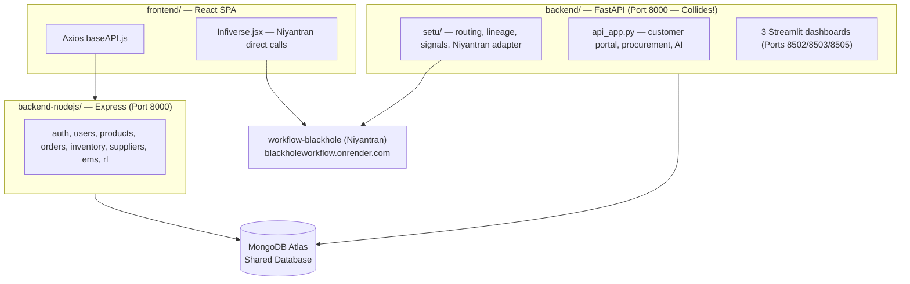

# Handover Review Packet — ai-crm (CRM + Logistics + SETU)

**Repository Root:** `ai-crm/`  
**System Owner:** Shashank Mishra  
**Target Reviewers / Successors:** Vijay Dhawan, Isha Singh, Soham Kotkar  
**Ecosystem Acceptance Authority:** Rishabh Yadav  

---

## 1. System Overview & Core Architecture

Per `ECOSYSTEM_REPOSITORY_MAP.md`, this repository contains the **CRM** (relationship intelligence), **Logistics** (inventory/order/supplier management), and the **SETU** module. 

Successors must understand the single most important architectural fact about this repo: **It contains two completely separate backend applications that write to a single shared MongoDB database:**



*   **`backend/` (FastAPI):** Exposes 112 endpoints. Runs the SETU integration logic, procurement module, customer portal, and serves 3 standalone Streamlit dashboards.
*   **`backend-nodejs/` (Express):** Exposes 70 endpoints. This is the **primary backend** that the React frontend actually communicates with for day-to-day operations.
*   **MongoDB Atlas:** Shared by both backends, exposing a high-risk schema collision.

---

## 2. Onboarding Flow (Suggested Review Order)

Follow this step-by-step sequence to review the system components:

```
[00_HANDOVER_PLAN.md] ──► [01_EXECUTIVE_OVERVIEW.md] ──► [02_ARCHITECTURE_GUIDE.md]
                                                                  │
  ┌───────────────────────────────────────────────────────────────┘
  ▼
[03a/03b Code Walkthroughs] ──► [05_DATABASE_GUIDE.md] ──► [04_DEPLOY_GUIDE / 08_RUNBOOK]
                                                                  │
  ┌───────────────────────────────────────────────────────────────┘
  ▼
[07_KNOWN_ISSUES_REGISTER.md] ──► [13_EVIDENCE_PACKET.md] ──► [14_EXECUTIVE_ASSESSMENT.md]
```

1.  **Start here:** Read [handover/00_HANDOVER_PLAN.md](file:///c:/Users/shash/OneDrive/Documents/New folder/ai-crm/handover/00_HANDOVER_PLAN.md) for the audit methodology and task mapping.
2.  **Executive Overview:** Read [handover/01_EXECUTIVE_OVERVIEW.md](file:///c:/Users/shash/OneDrive/Documents/New folder/ai-crm/handover/01_EXECUTIVE_OVERVIEW.md) for readiness assessment and limitations.
3.  **Architecture:** Review [handover/02_ARCHITECTURE_GUIDE.md](file:///c:/Users/shash/OneDrive/Documents/New folder/ai-crm/handover/02_ARCHITECTURE_GUIDE.md) to understand service boundaries and data flow.
4.  **Source Code:** Study the separate walkthroughs:
    *   [handover/03a_BACKEND_PYTHON_WALKTHROUGH.md](file:///c:/Users/shash/OneDrive/Documents/New folder/ai-crm/handover/03a_BACKEND_PYTHON_WALKTHROUGH.md) (FastAPI + SETU)
    *   [handover/03b_BACKEND_NODEJS_WALKTHROUGH.md](file:///c:/Users/shash/OneDrive/Documents/New folder/ai-crm/handover/03b_BACKEND_NODEJS_WALKTHROUGH.md) (Express)
5.  **Database & Schema Drift:** Review [handover/05_DATABASE_GUIDE.md](file:///c:/Users/shash/OneDrive/Documents/New folder/ai-crm/handover/05_DATABASE_GUIDE.md) to examine collection-level schema incompatibilities.
6.  **Deployments & Operations:** Read [handover/04_DEPLOYMENT_GUIDE.md](file:///c:/Users/shash/OneDrive/Documents/New folder/ai-crm/handover/04_DEPLOYMENT_GUIDE.md) and [handover/08_OPERATIONS_RUNBOOK.md](file:///c:/Users/shash/OneDrive/Documents/New folder/ai-crm/handover/08_OPERATIONS_RUNBOOK.md).
7.  **Bugs & Risks:** Check [handover/07_KNOWN_ISSUES_REGISTER.md](file:///c:/Users/shash/OneDrive/Documents/New folder/ai-crm/handover/07_KNOWN_ISSUES_REGISTER.md) for the 15 verified findings.
8.  **Evidence Checklist:** Read [handover/13_EVIDENCE_PACKET.md](file:///c:/Users/shash/OneDrive/Documents/New folder/ai-crm/handover/13_EVIDENCE_PACKET.md) to see what tests were run and what screenshots/logs are still required from production.
9.  **Next Steps:** Read [handover/14_EXECUTIVE_ASSESSMENT.md](file:///c:/Users/shash/OneDrive/Documents/New folder/ai-crm/handover/14_EXECUTIVE_ASSESSMENT.md) for risks and recommendations.

---

## 3. Core Runtime & API Summary

*   **FastAPI Backend Default Port:** `8000` (runs Uvicorn)
*   **Express Backend Default Port:** `8000` (collides with FastAPI)
*   **API Documentation:**
    *   Python endpoints (FastAPI): [handover/06a_API_DOCUMENTATION_PYTHON_BACKEND.md](file:///c:/Users/shash/OneDrive/Documents/New folder/ai-crm/handover/06a_API_DOCUMENTATION_PYTHON_BACKEND.md)
    *   NodeJS endpoints (Express): [handover/06b_API_DOCUMENTATION_NODEJS_BACKEND.md](file:///c:/Users/shash/OneDrive/Documents/New folder/ai-crm/handover/06b_API_DOCUMENTATION_NODEJS_BACKEND.md)
*   **Dependency Map:** See [handover/09_DEPENDENCY_MAP.md](file:///c:/Users/shash/OneDrive/Documents/New folder/ai-crm/handover/09_DEPENDENCY_MAP.md) for details on external APIs (Google Maps, Office 365, Gemini) and Niyantran integration.

---

## 4. Key Verification Findings & Critical Blockers

The following items are production blockers and should be resolved immediately:

1.  **Shared-Database Schema Incompatibility (Severity: 🔴 Critical):** Both backends write to the same `products` and `orders` collections but define conflicting field structures (e.g. FastAPI expects a single-product order; Express expects an array `items`). This will cause data corruption.
2.  **Missing `start_server.py` (Severity: 🔴 Critical):** FastAPI's `Procfile` and `railway.json` point to a non-existent file, breaking Railway/Heroku deployment.
3.  **FastAPI Misconfigured Ingress Proxy (Severity: 🔴 Critical):** FastAPI's `INFIVERSE_BASE_URL` is set to `localhost:5000`, which breaks all 23 Niyantran-proxy endpoints in production.
4.  **No FastAPI JWT Startup Guard (Severity: 🔴 Critical):** FastAPI starts up even if `JWT_SECRET_KEY` is missing, silently falling back to a guessable default committed in git.
5.  **Weak Automated Test Coverage (Severity: 🟠 High):** Node backend has no tests. Python backend has collection failures in `pytest` due to a missing `chatbot_agent` module, and `test_get_returns_endpoint` hangs.

---

## 5. Reviewer Sign-off Checklist

This checklist must be signed off by successors and the product owner to verify completion:

| Task / Verify Item | Status | Verified By | Date | Comments |
| :--- | :---: | :--- | :--- | :--- |
| Both backends run locally | [ ] | | | Requires port re-configuration |
| FastAPI code integrity check | [ ] | | | Checked 135 files via `py_compile` |
| Node Express code integrity check | [ ] | | | Checked 28 files via `node --check` |
| Shared DB collection structures reconciled | [ ] | | | Needs alignment on schemas |
| Port assignment separated | [ ] | | | Assign unique ports |
| Missing `start_server.py` script fixed | [ ] | | | Create script or fix Dockerfile |
| Frontend builds and points to correct backend | [ ] | | | Verified via `npm run build` |
| Demonstration Video recorded | [ ] | | | Plan outlined in `00_HANDOVER_PLAN.md` |
| Production Evidence Pack compiled | [ ] | | | Add Atlas & Live Ingress screenshots |

---

*This document supersedes all older root-level handover and gap document checklists in this repository.*
