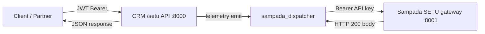

# SETU End-to-End Runtime Validation Reference

**Repository:** `ai-crm/`  
**Last updated:** 2026-07-17  
**Scope:** Infiverse SETU visibility layer (not setu.co fintech)

This document is the integration packet for validating SETU end-to-end. Use it with the automated runner at [`backend/scripts/run_setu_e2e_validation.py`](backend/scripts/run_setu_e2e_validation.py) and pytest suite [`backend/tests/test_setu_e2e.py`](backend/tests/test_setu_e2e.py).

---

## Architecture



---

## 1. Endpoints / base URLs

| Surface | Base URL | Role |
|---|---|---|
| **Local CRM SETU API** | `http://localhost:8000/setu` | Ingest, route/observe, Niyantran visibility, UI reads |
| **Outbound Sampada SETU gateway** | `{SAMPADA_SETU_BASE_URL}` | CRM posts `crm_participation` signals |
| **Live Swagger** | `http://localhost:8000/docs` | Runtime OpenAPI (tag: `setu`) |

**Start command:** from `backend/` run `uvicorn api_app:app --host 0.0.0.0 --port 8000`

### Local `/setu` routes

| Method | Path | Purpose |
|---|---|---|
| POST | `/setu/route` | Observe-only sovereign routing |
| GET | `/setu/lineage/{trace_id}` | Lineage events |
| GET | `/setu/telemetry/{trace_id}` | Telemetry events |
| POST | `/setu/signals/ingest` | Ingest Sampada signal |
| GET | `/setu/signals/{trace_id}` | List ingested signals |
| POST | `/setu/niyantran/task-state` | Consume task state |
| POST | `/setu/niyantran/submission-state` | Consume submission state |
| POST | `/setu/niyantran/execution-status` | Consume execution status |
| GET | `/setu/niyantran/timeline/{trace_id}` | Execution timeline |
| POST | `/setu/contract/validate` | Cross-system contract check |
| GET | `/setu/bucket/verify/{execution_id}/{trace_id}` | Bucket history verify |
| GET | `/setu/bucket/lineage/{trace_id}` | Bucket lineage |
| POST | `/setu/test/failures` | Failure scenario tests |
| GET | `/setu/failures/{trace_id}` | Failure logs |
| GET | `/setu/ui/dashboard/{trace_id}` | Complete visibility dashboard |

### Outbound gateway URL

```
POST {SAMPADA_SETU_BASE_URL}/v1/setu/signals/crm_participation
```

Implemented in [`backend/setu/sampada_dispatcher.py`](backend/setu/sampada_dispatcher.py). Triggered from [`TelemetryLayer.emit()`](backend/setu/telemetry_layer.py) after route telemetry. Success = HTTP 200 only.

---

## 2. API documentation

| Artifact | SETU coverage |
|---|---|
| Live FastAPI Swagger | `http://localhost:8000/docs` |
| Static OpenAPI under `backend/docs/` | No `/setu` paths — use live docs |
| Execution contract | [`contracts/execution/EXECUTION_CONTRACT_SPEC.md`](contracts/execution/EXECUTION_CONTRACT_SPEC.md) |
| Curl samples | [`SETU_FLOW_PROOF.md`](SETU_FLOW_PROOF.md) |
| Review index | [`REVIEW_PACKET.md`](REVIEW_PACKET.md) |

---

## 3. Request payload formats

### Signal ingest — `POST /setu/signals/ingest`

```json
{
  "trace_id": "trace_proof_001",
  "entity_id": "candidate_001",
  "event_type": "task_submitted",
  "signal_type": "execution",
  "severity": "medium",
  "timestamp": "2024-12-19T10:30:00Z",
  "tenant_id": "tenant_proof",
  "payload": { "task_id": "task_001", "result": "success" }
}
```

### Execution route — `POST /setu/route`

Use the `execution_contract` object from [`end_to_end_trace.json`](end_to_end_trace.json) as the POST body. Required fields: `execution_id`, `trace_id`, `source_system`, `actor`, `intent_type`, `target_system`, `parameters`, `priority`, `timestamp`, `schema_version` (`"1.0"`), `tenant_id`, plus `governance.gated_bridge` with `status: "approved"`.

### Niyantran task state — `POST /setu/niyantran/task-state`

```json
{
  "task_id": "task_001",
  "trace_id": "trace_proof_001",
  "tenant_id": "tenant_proof",
  "state": "in_progress",
  "timestamp": "2024-12-19T10:35:00Z"
}
```

### Outbound Sampada body (CRM → gateway)

```json
{
  "signal_type": "crm_participation",
  "payload": {},
  "workforce_ref_id": null,
  "source_declaration": "crm participation",
  "origin_system": "crm",
  "owning_system": "crm",
  "trace_id": "<uuid>",
  "correlation_id": "<uuid>",
  "trust_classification": "observed",
  "visibility_scope": "tenant"
}
```

---

## 4. Authentication

| Path | Auth |
|---|---|
| All local `/setu/*` | `Authorization: Bearer <JWT>` |
| Outbound Sampada gateway | `Authorization: Bearer {SAMPADA_SETU_API_KEY}` |

**Obtain JWT:**

```bash
curl -X POST http://localhost:8000/auth/login \
  -H "Content-Type: application/json" \
  -d '{"username":"admin","password":"admin123"}'
```

Default demo users: `admin/admin123`, `manager/manager123`, `operator/operator123`.

---

## 5. Expected response formats

### Signal ingest success

```json
{
  "success": true,
  "ingestion_id": "ing_YYYYMMDD_HHMMSS_<trace8>",
  "trace_id": "trace_proof_001",
  "message": "Signal ingested successfully"
}
```

### Route success

```json
{
  "ok": true,
  "mode": "observe_only",
  "routing": { "ok": true, "sarathi_payload": {}, "bhiv_envelope": {}, "governance": {} },
  "lineage_events": [],
  "telemetry_events": []
}
```

### Outbound dispatch (internal)

```json
{
  "dispatched": true,
  "request": { "method": "POST", "url": "...", "body": {} },
  "response": { "status": 200, "body": null }
}
```

Note: dispatch failures are swallowed in telemetry — verify gateway logs separately.

---

## 6. Environment variables

| Variable | Purpose | Example |
|---|---|---|
| `MONGODB_URL` | SETU persistence | `mongodb://localhost:27017/ai_crm_logistics` |
| `SAMPADA_SETU_ENABLED` | Gate outbound dispatch | `true` |
| `SAMPADA_SETU_BASE_URL` | Gateway base | `http://localhost:8001` |
| `SAMPADA_SETU_API_KEY` | Gateway Bearer token | secret |
| `SAMPADA_SETU_TIMEOUT_S` | httpx timeout | `30` |
| `JWT_SECRET_KEY` | CRM JWT signing | from `.env` |

See [`backend/.env.example`](backend/.env.example) for the full template.

---

## 7. Test workflows

### Prerequisites

1. MongoDB running and reachable via `MONGODB_URL`
2. CRM started: `cd backend && uvicorn api_app:app --port 8000`
3. Sampada gateway on `:8001` (or use `--mock-gateway` with the validation script)
4. JWT obtained from `/auth/login`

### Workflow A — Visibility path

1. `POST /setu/signals/ingest` (sample above)
2. `POST /setu/niyantran/task-state` (matching `trace_id`)
3. `GET /setu/ui/dashboard/{trace_id}`
4. Optional: `POST /setu/test/failures`

### Workflow B — Route + outbound round-trip

1. Set `SAMPADA_SETU_ENABLED=true`
2. `POST /setu/route` with `execution_contract` from `end_to_end_trace.json`
3. Expect `ok: true`, `mode: "observe_only"`
4. Confirm gateway received `POST .../v1/setu/signals/crm_participation` with HTTP 200
5. `GET /setu/telemetry/{trace_id}` and `GET /setu/lineage/{trace_id}` — trace preserved

### Workflow C — Contract cross-check

`POST /setu/contract/validate` with aligned `niyantran_event`, `sampada_signal`, `setu_ingestion`.

---

## 8. Automated validation

### Pytest (unit + integration with in-memory store)

```bash
cd backend
pytest tests/test_setu_e2e.py -v
```

### Live runtime script

```bash
cd backend
python scripts/run_setu_e2e_validation.py --base-url http://localhost:8000
python scripts/run_setu_e2e_validation.py --mock-gateway   # starts local gateway stub on :8001
```

---

## 9. Sample curls (Workflow A)

```bash
TOKEN=$(curl -s -X POST http://localhost:8000/auth/login \
  -H "Content-Type: application/json" \
  -d '{"username":"admin","password":"admin123"}' | python -c "import sys,json; print(json.load(sys.stdin)['access_token'])")

curl -X POST http://localhost:8000/setu/signals/ingest \
  -H "Content-Type: application/json" \
  -H "Authorization: Bearer $TOKEN" \
  -d '{
    "trace_id": "trace_proof_001",
    "entity_id": "candidate_001",
    "event_type": "task_submitted",
    "signal_type": "execution",
    "severity": "medium",
    "timestamp": "2024-12-19T10:30:00Z",
    "tenant_id": "tenant_proof"
  }'

curl -X POST http://localhost:8000/setu/niyantran/task-state \
  -H "Content-Type: application/json" \
  -H "Authorization: Bearer $TOKEN" \
  -d '{
    "task_id": "task_001",
    "trace_id": "trace_proof_001",
    "tenant_id": "tenant_proof",
    "state": "in_progress",
    "timestamp": "2024-12-19T10:35:00Z"
  }'

curl -X GET http://localhost:8000/setu/ui/dashboard/trace_proof_001 \
  -H "Authorization: Bearer $TOKEN"
```

### Sample route (Workflow B)

```bash
curl -X POST http://localhost:8000/setu/route \
  -H "Content-Type: application/json" \
  -H "Authorization: Bearer $TOKEN" \
  -d @- <<'EOF'
<paste execution_contract object from end_to_end_trace.json>
EOF
```

---

## 10. Runtime fixes applied (2026-07-17)

| Gap | Fix |
|---|---|
| F1 / GAP-002 | `SovereignRoutingAdapter()` — no longer passes `setu_store` as validator |
| F5 / GAP-003 | Middleware scoped to `POST /setu/route` only |
| F2 / GAP-004 | `pymongo` + `motor` added to `requirements.txt` |
| F9 / GAP-009 | `SAMPADA_SETU_*` + `MONGODB_URL` documented in `.env.example` |

---

## 11. Live deployment test (2026-07-17)

| URL | Role | SETU |
|---|---|---|
| `https://ai-crm-4nje.onrender.com` | Node.js CRM API — configured in Vercel frontend bundle | **No** — `/setu/*` and `/auth/login` return 404 |
| `https://setu.blackholeinfiverse.com` | SETU frontend (Vercel) | UI only |
| Python SETU API | Not yet deployed to production | Required for E2E |

**Live test result:** Health OK on Render, but SETU E2E **blocked** — live host runs `backend-nodejs`, not Python `api_app.py`.

Deploy Python on Render with start command `uvicorn api_app:app --host 0.0.0.0 --port $PORT`, then re-run:

```bash
python scripts/run_setu_e2e_validation.py --base-url https://<your-python-api-host>
```
