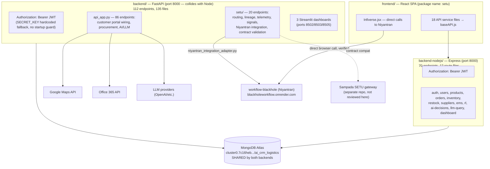

# Architecture Guide — ai-crm (CRM + Logistics + SETU)

## 1. High-level architecture



**In one sentence:** one React app that mostly talks to a Node.js CRM/logistics API, alongside a much larger Python/FastAPI service that owns SETU, the customer portal, procurement, AI features, and three analytics dashboards — with both backends reading and writing the same MongoDB database.

## 2. Module breakdown

### `backend/` (Python/FastAPI) — see `03a_BACKEND_PYTHON_WALKTHROUGH.md` for full detail

| Area | File(s) | Endpoint count |
|---|---|---|
| Main API | `api_app.py` | 86 (direct) |
| SETU | `setu/*.py` (16 files) | 20, prefix `/setu` |
| Customer portal | `customer_portal_api.py` | 6, included via `include_router` |
| Not wired into `api_app.py` at all | `crm_api.py`, `courier_api.py`, `supplier_api.py`, `api_chatbot_endpoints.py` | Standalone/legacy scripts — see Known Issues |
| Streamlit dashboards | `crm_dashboard.py`, `dashboard_app.py`, (a third product-catalog dashboard) | N/A — separate UI, not REST |

### `backend-nodejs/` (Express) — see `03b_BACKEND_NODEJS_WALKTHROUGH.md` for full detail

12 route files, all actively mounted in `src/server.js`: `auth`, `users`, `products`, `orders`, `inventory`, `restock`, `ems`, `rl`, `aiDecisions`, `llmQuery`, `dashboard`, `suppliers`. 6 Mongoose models: `User`, `Product`, `Order`, `Supplier`, `RestockRequest`, `InventoryLog`.

### `frontend/` (React, package name literally `setu`)

`src/services/api/` contains 18 files, all but one importing the same `baseAPI.js` Axios client pointed at `backend-nodejs`. The one exception, `Infiverse.jsx`, calls `workflow-blackhole`'s live production URL directly.

## 3. Service interactions

- **Frontend → Node backend:** REST over HTTPS, `Authorization: Bearer <jwt>` header (standard convention — confirmed in `src/middleware/auth.js`, different from workflow-blackhole's `x-auth-token`).
- **Frontend → Niyantran (workflow-blackhole), directly:** `src/pages/Infiverse.jsx` calls `https://blackholeworkflow.onrender.com/api/crm-integration/workflow-dashboard` and `/auth/login` directly from the browser, bypassing both of this repo's own backends for that one view. This is a real, verified, live cross-repository dependency.
- **Python backend → MongoDB Atlas:** via `database/mongodb_connection.py`, using Motor (async) and PyMongo. **Verified finding:** the "Connected to MongoDB" log line is printed as soon as the client object is constructed, not after a real ping — don't trust that log line alone as proof of connectivity (see `13_EVIDENCE_PACKET.md`).
- **Node backend → MongoDB Atlas:** via Mongoose, same database.
- **Python backend → Google Maps, Office 365, LLM providers:** optional integrations (`integrations/` folder), degrade gracefully if keys are absent (Google Maps explicitly logs a warning and continues, per direct code read).
- **SETU → Niyantran:** `setu/niyantran_integration_adapter.py` plus the `/setu/niyantran/*` endpoints are the code-level integration point.
- **SETU → Sampada:** contract-level only (per `ECOSYSTEM_REPOSITORY_MAP.md`, the routes/schemas are meant to be compatible with Sampada's own SETU gateway) — no direct HTTP call to Sampada was found in this codebase; the relationship is "compatible contract," not "calls it directly."

## 4. Authentication — verified, and different per backend

| | Python backend | Node backend |
|---|---|---|
| Header | `Authorization: Bearer <jwt>` (`fastapi.security.HTTPBearer`) | `Authorization: Bearer <jwt>` |
| Signing key source | `os.getenv("JWT_SECRET_KEY", "ai-agent-logistics-secret-key-2025")` | (see `03b` for the exact Node-side variable) |
| Startup guard if key is unset | **None found** — silently falls back to the hardcoded default string | Not independently verified to hard-fail; check `03b` |
| SETU routes | Same `get_current_user` dependency as the rest of the app — **verified, not left open** | N/A |

**Verified, worth flagging directly:** unlike workflow-blackhole (which refuses to boot without `JWT_SECRET`), this Python backend has no equivalent startup check for `JWT_SECRET_KEY` — if it's ever unset in an environment, the app will start normally and silently sign tokens with the hardcoded fallback string instead of failing loudly. The `.env` reviewed here does set a value, but that value is literally `ai-crm-logistics-super-secret-jwt-key-2026-change-in-production` — a string that names itself as a placeholder. See `07_KNOWN_ISSUES_REGISTER.md`.

## 5. Data flow (typical request, Node backend — the one the main UI actually uses)

```
Browser → Axios (baseAPI.js, Authorization: Bearer header)
  → Express app (helmet, cors, rate-limit)
  → src/middleware/auth.js verifies JWT
  → route handler (e.g. src/routes/products.js)
  → Mongoose model (e.g. src/models/Product.js)
  → MongoDB Atlas (ai_crm_logistics database)
  → response JSON
```

## 6. Deployment architecture

- **`backend/`** ships 3 different deploy paths that **do not agree with each other** — verified by reading all three directly:
  - `Dockerfile` (plain): `CMD ["uvicorn", "api_app:app", ...]` — **works as-is**.
  - `Dockerfile.production` + `docker-entrypoint.sh`: requires `DATABASE_URL` and `SECRET_KEY` env vars to be set or it refuses to start (`exit 1`). The real `.env` sets `DATABASE_URL` to a leftover SQLite string (not the actual Mongo connection the app uses) and does **not** set `SECRET_KEY` at all (only `JWT_SECRET_KEY`, a different name) — **this path will not start as currently configured**.
  - `Procfile` (`web: python start_server.py`) and `railway.json` (`"startCommand": "python start_server.py"`): both point at a file that **does not exist anywhere in this repository** — confirmed by a repo-wide file search. Both Heroku-style and Railway deploys using these configs will fail immediately.
- **`backend-nodejs/`** has no Dockerfile, Procfile, or platform config file at all in this repo — its deployment mechanism isn't defined here; confirm with the team how/where it's actually hosted (see `04_DEPLOYMENT_GUIDE.md`).
- **`frontend/`** — standard Vite build; no deployment config (e.g. `vercel.json`, `netlify.toml`) found in this repo either.

## 7. Repository structure (top level)

```
ai-crm/
├── backend/                 Python/FastAPI — SETU, customer portal, procurement, AI, dashboards
│   ├── setu/                 SETU module (16 files, 20 endpoints)
│   ├── database/              MongoDB + SQLite(legacy) connection layers
│   ├── integrations/           Google Maps, Office 365, LLM query
│   ├── BHIV_Integrator_Core/    27 files — ecosystem integration core
│   ├── tests/                  4 pytest files — 2 fail to collect (see Known Issues)
│   └── (72 top-level scripts, dashboards, and utilities)
├── backend-nodejs/          Express — the frontend's actual day-to-day backend
│   └── src/{routes,models,middleware,config}/
├── frontend/                 React SPA (package.json name: "setu")
├── contracts/, engine/, integration/, middleware/   Additional ecosystem-adjacent folders (see 03a)
├── SETU Ownership Transition__ Phase II (Post-Handover Audit)/   Pre-existing, dated (2026-07-04) SETU audit trail
├── HANDOVER.md, README.md, REVIEW_PACKET.md, plus ~15 other status/proof .md files   (pre-existing docs)
└── handover/                 ← this documentation package
```

## 8. Environment configuration — categorized

Full register in `11_CREDENTIALS_CONFIGURATION_REGISTER.md`. Both backends have their own `.env`/`.env.example` pair; the important cross-cutting facts:

| Fact | Verified detail |
|---|---|
| Both backends' `MONGODB_URL` are identical | Same cluster, same database name (`ai_crm_logistics`), same username |
| Both backends default to port 8000 | `backend/.env`: `API_PORT=8000`; `backend-nodejs/.env`: `PORT=8000` — **both files even contain the same comment** noting the collision with a third system (`INFIVERSE gateway on 8001`), but not with each other |
| Python backend's `SECRET_KEY` (required by `docker-entrypoint.sh`) is absent | Only `JWT_SECRET_KEY` is set — different variable name |
| Python backend's `DATABASE_URL` is a leftover SQLite string | Not the Mongo connection actually used by the app |

## 9. External dependencies

| Dependency | Used by | Required? |
|---|---|---|
| MongoDB Atlas | Both backends | Required |
| Google Maps API | Python backend | Optional — degrades gracefully, confirmed by code |
| Office 365 API | Python backend | Optional |
| LLM provider(s) (OpenAI etc.) | Python backend (`llm_query_system.py`), Node backend (`llmQuery.js`) | Optional feature |
| workflow-blackhole production API | Frontend (`Infiverse.jsx`), SETU (`niyantran_integration_adapter.py`) | Required for those specific features |
| npm / PyPI registries | Both, at build/install time | Required at build time |
